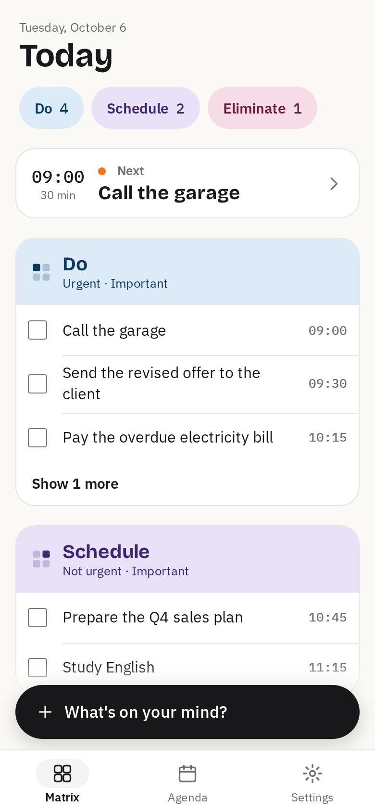
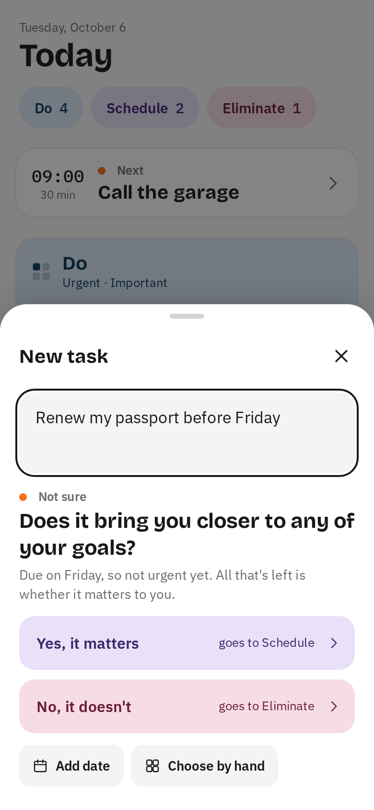
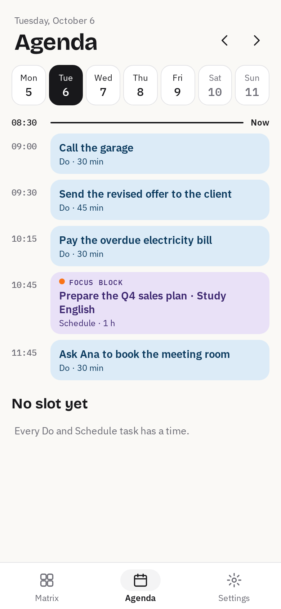
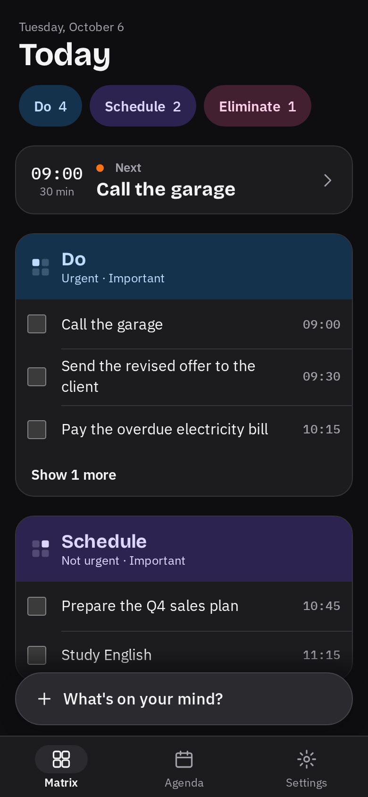

<a id="readme-top"></a>

<!-- PROJECT SHIELDS -->
[![Version][version-shield]][changelog-url]
[![License][license-shield]][license-url]
[![SvelteKit][Svelte.dev]][Svelte-url]
[![TypeScript][TypeScript]][TypeScript-url]
[![PWA][PWA]][PWA-url]

<!-- PROJECT LOGO -->
<br />
<div align="center">
  <a href="https://github.com/iisra-dev/qadrant">
    
  </a>

<h3 align="center">Qadrant Calendar</h3>

  <p align="center">
    A phone-first Eisenhower-matrix planner that sorts your tasks on your own device.
    <br />
    <a href="docs/"><strong>Explore the docs »</strong></a>
    <br />
    <br />
    <a href="https://qadrant-62h.pages.dev">Open it on your phone</a>
    &middot;
    <a href="CHANGELOG.md">Changelog</a>
    &middot;
    <a href="docs/06-hoja-de-ruta.md">Roadmap</a>
  </p>
</div>

Current version: **1.4.2** (Oct 8, 2026). See [`CHANGELOG.md`](CHANGELOG.md) for changes.

<!-- TABLE OF CONTENTS -->
<details>
  <summary>Table of Contents</summary>
  <ol>
    <li>
      <a href="#about-the-project">About The Project</a>
      <ul>
        <li><a href="#built-with">Built With</a></li>
      </ul>
    </li>
    <li><a href="#install-on-your-phone">Install on your phone</a></li>
    <li>
      <a href="#getting-started">Getting Started</a>
      <ul>
        <li><a href="#prerequisites">Prerequisites</a></li>
        <li><a href="#installation">Installation</a></li>
      </ul>
    </li>
    <li>
      <a href="#usage">Usage</a>
      <ul>
        <li><a href="#commands">Commands</a></li>
        <li><a href="#testing-on-webkit-safari">Testing on WebKit (Safari)</a></li>
        <li><a href="#deploying-to-cloudflare-pages">Deploying to Cloudflare Pages</a></li>
        <li><a href="#landing-page">Landing page</a></li>
        <li><a href="#self-hosted-server-optional">Self-hosted server (optional)</a></li>
        <li><a href="#working-with-claude-code">Working with Claude Code</a></li>
        <li><a href="#repository-layout">Repository layout</a></li>
      </ul>
    </li>
    <li><a href="#roadmap">Roadmap</a></li>
    <li><a href="#contributing">Contributing</a></li>
    <li><a href="#license">License</a></li>
    <li><a href="#contact">Contact</a></li>
    <li><a href="#acknowledgments">Acknowledgments</a></li>
  </ol>
</details>


<!-- ABOUT THE PROJECT -->
## About The Project

<p align="center">
  
  &nbsp;
  
  &nbsp;
  
  &nbsp;
  
</p>

**Qadrant** (full name "Qadrant Calendar"; "Qadrant" under the icon) is a planner built for your phone on the Eisenhower matrix: **Do**, **Schedule**, **Delegate** and **Eliminate**. Type or dictate a task in plain language and the app places it in a quadrant. It is a PWA: you add it to your home screen and it behaves like a native app, without an app store.

* **Made for one hand.** A single "What's on your mind?" button and the microphone sit at the bottom of the screen; the next task is always on top; bottom tabs for Matrix, Agenda and Settings. Touch targets are at least 44 px.
* **Capture in seconds.** Write or dictate "call the garage tomorrow at 10" and it picks up the date, the time and the duration. When it is not sure, it asks one question instead of guessing.
* **A plan for your day.** "Find them a slot" places your Do and Schedule tasks in the free time of the day, around your calendar events.
* **Everything stays on the device.** Tasks live in IndexedDB and never leave the device unless you set up your own server. No analytics, no telemetry.
* **On-device classification.** Rules work out urgency from the date, and a small multilingual embedding model (`paraphrase-multilingual-MiniLM-L12-v2`) decides importance by comparing the task with your goals. The model runs in a Web Worker and is served from our own origin.
* **Works without AI.** If the model is not downloaded or fails, tasks are sorted with rules and manual choice.
* **The AI suggests, you decide.** Any classification can be changed with one tap, and every correction is saved to tune the assistant.
* **Bilingual.** The interface is in English (US) and Spanish (Spain); tasks are read in the chosen language and, if nothing is recognized, in the other one.
* **Offline.** Once installed, it opens and works without a connection, on the subway or on a plane.
* **Reminders on your phone** with the optional self-hosted server (on iPhone, with the app installed).
* **Also on desktop.** The same app adapts to tablet and desktop, with a week view and keyboard shortcuts.

The full specification is in [`docs/`](docs/) and the mockups are in [`design/screens/`](design/screens/). Both are written in Spanish.

<p align="right">(<a href="#readme-top">back to top</a>)</p>


### Built With

* [![Svelte][Svelte.dev]][Svelte-url] SvelteKit with `adapter-static` (SPA) and strict TypeScript
* [![Vite][Vite]][Vite-url] `@vite-pwa/sveltekit` (Workbox, `injectManifest`)
* [![Dexie][Dexie]][Dexie-url] Dexie.js on top of IndexedDB
* [![ONNX][ONNX]][ONNX-url] ONNX Runtime Web (WebGPU with WASM fallback) and the Transformers.js tokenizer
* [chrono-node](https://github.com/wanasit/chrono) to parse dates in English and Spanish
* [![Vitest][Vitest]][Vitest-url] [![Playwright][Playwright]][Playwright-url] unit and end-to-end tests
* [![Go][Go]][Go-url] [PocketBase](https://pocketbase.io/) for the optional server
* [![Cloudflare][Cloudflare]][Cloudflare-url] Cloudflare Pages for hosting

<p align="right">(<a href="#readme-top">back to top</a>)</p>


<!-- INSTALL -->
## Install on your phone

Open [qadrant-62h.pages.dev](https://qadrant-62h.pages.dev) on your phone and add it to the home screen:

* **iPhone (Safari):** tap Share, then "Add to Home Screen". Install it: iOS can delete the data of a website you have not visited for a few days, but not that of an installed app. Notifications on iPhone also need the app installed.
* **Android (Chrome):** tap the menu, then "Install app" (or accept the install banner).

On first launch, pick your language and write your main goal; the app uses it to decide what is important. The assistant model (about 113 MiB) downloads on its own when you are on Wi-Fi; until then, tasks are sorted with rules. Your tasks stay on the phone: export them from Settings now and then as a backup.

The iPhone is the reference device: performance and features are measured there first (classifying a task takes about 74 ms with WebGPU).

<p align="right">(<a href="#readme-top">back to top</a>)</p>


<!-- GETTING STARTED -->
## Getting Started

### Prerequisites

* Node 22
* pnpm 10
  ```sh
  npm install -g pnpm@10
  ```
* Go 1.27 or later, only for the optional server (`server/`).

### Installation

1. Clone the repo
   ```sh
   git clone https://github.com/iisra-dev/qadrant.git
   cd qadrant
   ```
2. Install the dependencies
   ```sh
   pnpm install
   ```
3. Install Chromium for the end-to-end tests (first time only)
   ```sh
   pnpm exec playwright install chromium
   ```
4. Start the dev server
   ```sh
   pnpm dev
   ```
5. To try it on your phone, expose it on your local network and open the address it prints
   ```sh
   pnpm dev --host
   ```
   Browser dev tools in phone mode (390 x 844, the size the end-to-end tests use) are fine for layout. The service worker, installing and offline mode need `pnpm build && pnpm preview` over HTTPS, or the deployed site.

The app works without the model: it classifies with rules. To use the assistant, see [Deploying with the model](#deploying-with-the-model).

<p align="right">(<a href="#readme-top">back to top</a>)</p>


<!-- USAGE EXAMPLES -->
## Usage

### Commands

```sh
pnpm dev            # dev server
pnpm build          # static build in build/
pnpm preview        # serves the build (needed to test the service worker)
pnpm test           # vitest (with TZ=Europe/Madrid)
pnpm test:e2e       # playwright on Chromium, at phone size
pnpm test:e2e:webkit  # playwright on WebKit, inside a container
pnpm check          # svelte-check + tsc
pnpm deploy:pages   # builds and publishes to Cloudflare Pages
```

### Testing on WebKit (Safari)

`pnpm test:e2e` uses Chromium. `pnpm test:e2e:webkit` runs the same tests on WebKit, the engine behind Safari on iPhone, inside the official Playwright container (podman or docker): Playwright's WebKit needs Ubuntu libraries that Fedora does not ship. The script builds, serves `build/` on port 4173 and launches the browser in the container. The first run downloads the image (about 2 GB).

Skipped on WebKit, with the reason in each test: notifications (Chromium only), the two offline tests (Playwright WebKit fails to reload offline with a service worker) and the model test (Playwright's WebKit has no OPFS; Safari does).

### Deploying to Cloudflare Pages

1. `pnpm exec wrangler login` (opens the browser to sign in to your Cloudflare account).
2. `pnpm exec wrangler pages project create qadrant --production-branch main --force` (first time only). `--force` creates a classic Pages project: without it, wrangler 4.14x tries to create it as a Worker and fails. It already exists: `https://qadrant-62h.pages.dev`.
3. `pnpm deploy:pages` (builds and publishes `build/`).
4. On the `*.pages.dev` URL, check that the browser console reports `crossOriginIsolated === true` and that the app opens offline after the first visit.

To use a different project name, change it in the `deploy:pages` script in `package.json`.

#### Deploying with the model

The model (about 113 MiB) is not in git. From a machine that has it downloaded (`tools/embed-eval/fetch_model.py`):

1. `pnpm model:prepare`: splits it into 25 MiB chunks in `static/models/`, with a manifest (version, size and SHA-256 of each chunk) and the default calibration.
2. `pnpm deploy:pages`: the build also copies ONNX Runtime to `/ort/` in chunks.

A deployment without `static/models/` still works: Settings says the server does not offer the assistant and the app classifies with rules.

### Landing page

A static, script-free presentation page lives in `site/` (separate from the app). `pnpm site:build` writes it to `site/dist` (English at `/`, Spanish at `/es/`), `pnpm site:preview` serves it on port 4174 and `pnpm site:deploy` publishes it to the Cloudflare Pages project `qadrant-site`. Set `QADRANT_APP_URL` and `QADRANT_SITE_URL` when the domains change.

### Self-hosted server (optional)

Qadrant works fully without a server and does not provide one. Anyone who wants reminders, a calendar or the same tasks on all their devices (sync, off by default) can run their own by following [`server/README.md`](server/README.md). Each server belongs to one person and serves all of their devices. Synced data is not encrypted: whoever runs that server, and the tunnel service if there is one, can read it. Each device keeps classifying with its own assistant. The server is also published on its own, with instructions in English and Spanish, at [github.com/iisra-dev/qadrant-server](https://github.com/iisra-dev/qadrant-server).

### Working with Claude Code

1. Open Claude Code at the repository root. It reads [`CLAUDE.md`](CLAUDE.md) automatically; that file holds the project rules.
2. Ask for one phase at a time, for example: "Implement phase 1 following docs/06-hoja-de-ruta.md. When you finish, tick the completed boxes."
3. Or let it work on its own with `/loop`, following the "Trabajo por iteraciones" section of `CLAUDE.md`: it stops when what is left depends on you (the boxes marked "(usuario)").

If anything conflicts, `CLAUDE.md` wins over `docs/`, and `docs/` wins over the mockups. The mockups show the look; the documents define the behavior.

### Repository layout

| Path | What it is |
| --- | --- |
| `src/` | The app (SvelteKit) |
| `server/` | Optional server in Go (PocketBase) |
| `CLAUDE.md` | Instructions for Claude Code: stack, conventions, non-negotiable rules |
| `docs/01-producto.md` | Vision, principles, screens, flows and detailed behavior |
| `docs/02-arquitectura.md` | Layers, stack, folder structure and PWA requirements |
| `docs/03-motor-de-decision.md` | How a task is classified: rules, model, thresholds and fallback |
| `docs/04-modelo-de-datos.md` | TypeScript types and IndexedDB schema |
| `docs/05-sistema-de-diseno.md` | Colors (light and dark), typography, spacing and components |
| `docs/06-hoja-de-ruta.md` | Phased action plan with tasks and exit criteria |
| `docs/07-riesgos-y-decisiones.md` | Risks, decisions made and open decisions |
| `design/tokens.css`, `design/tokens.json` | Ready-to-use design tokens |
| `design/screens/` | Static HTML mockups; open `index.html` in a browser |
| `design/canvas/` | Original design canvas sources (`.dc.html` + `canvas.json`) |
| `tools/laya-eval/` | Phase 0: evaluation of Laya on real tasks (shelved) and data (`tasks.csv`, `goals.txt`) |
| `tools/embed-eval/` | Phase 0: evaluation of the chosen engine (multilingual embeddings) |
| `tools/model-bench/` | In-browser model performance test page |
| `tools/laya-finetune/` | Laya fine-tuning, for the future |

<p align="right">(<a href="#readme-top">back to top</a>)</p>


<!-- ROADMAP -->
## Roadmap

- [x] Phase 0: validate the classification engine
- [x] Phase 1: MVP without AI (matrix, capture, agenda, settings, export and import, English and Spanish)
- [x] Phase 2: on-device AI (embedding model in the browser, calibration from your corrections)
- [x] Phase 3: agenda and reminders (scheduler, delegation, archiving, optional server with reminders and calendar)
- [ ] Phase 4: sync across devices and weekly review
    - [ ] Field-by-field merge and change queue
    - [ ] Sync on the self-hosted server
    - [ ] Publish the server in a public repository

The completed phases still have exit criteria that depend on real-world use. The full checklist is in [`docs/06-hoja-de-ruta.md`](docs/06-hoja-de-ruta.md).

<p align="right">(<a href="#readme-top">back to top</a>)</p>


<!-- CONTRIBUTING -->
## Contributing

This is a personal project in a private repository and does not accept outside contributions for now. The working conventions (small commits with conventional prefixes, tests before wiring logic into the UI, `pnpm check`, `pnpm test` and `pnpm build` passing) are in [`CLAUDE.md`](CLAUDE.md).

<p align="right">(<a href="#readme-top">back to top</a>)</p>


<!-- LICENSE -->
## License

The app: all rights reserved. Copyright © 2026 iisra-dev.

The server in [`server/`](server/) is distributed under the MIT License. See [`server/LICENSE`](server/LICENSE).

Third-party licenses are generated on every build and shown in the app itself ("Third-party licenses").

<p align="right">(<a href="#readme-top">back to top</a>)</p>


<!-- CONTACT -->
## Contact

iisra-dev: [github.com/iisra-dev](https://github.com/iisra-dev)

Project Link: [https://github.com/iisra-dev/qadrant](https://github.com/iisra-dev/qadrant)

<p align="right">(<a href="#readme-top">back to top</a>)</p>


<!-- ACKNOWLEDGMENTS -->
## Acknowledgments

* [sentence-transformers/paraphrase-multilingual-MiniLM-L12-v2](https://huggingface.co/sentence-transformers/paraphrase-multilingual-MiniLM-L12-v2)
* [ONNX Runtime Web](https://onnxruntime.ai/) and [Transformers.js](https://huggingface.co/docs/transformers.js)
* [Dexie.js](https://dexie.org/) and [chrono-node](https://github.com/wanasit/chrono)
* [PocketBase](https://pocketbase.io/) and [webpush-go](https://github.com/SherClockHolmes/webpush-go)
* [Bricolage Grotesque](https://github.com/ateliertriay/bricolage) and [IBM Plex](https://github.com/IBM/plex) typefaces, via [Fontsource](https://fontsource.org/)
* [Best-README-Template](https://github.com/othneildrew/Best-README-Template)

<p align="right">(<a href="#readme-top">back to top</a>)</p>


<!-- MARKDOWN LINKS & IMAGES -->
[version-shield]: https://img.shields.io/badge/version-1.1.0-0B3A5E?style=for-the-badge
[changelog-url]: CHANGELOG.md
[license-shield]: https://img.shields.io/badge/license-all%20rights%20reserved-555?style=for-the-badge
[license-url]: #license
[Svelte.dev]: https://img.shields.io/badge/Svelte-4A4A55?style=for-the-badge&logo=svelte&logoColor=FF3E00
[Svelte-url]: https://svelte.dev/
[TypeScript]: https://img.shields.io/badge/TypeScript-3178C6?style=for-the-badge&logo=typescript&logoColor=white
[TypeScript-url]: https://www.typescriptlang.org/
[PWA]: https://img.shields.io/badge/PWA-5A0FC8?style=for-the-badge&logo=pwa&logoColor=white
[PWA-url]: https://web.dev/explore/progressive-web-apps
[Vite]: https://img.shields.io/badge/Vite-646CFF?style=for-the-badge&logo=vite&logoColor=white
[Vite-url]: https://vite-pwa-org.netlify.app/frameworks/sveltekit
[Dexie]: https://img.shields.io/badge/Dexie.js-1E2A38?style=for-the-badge
[Dexie-url]: https://dexie.org/
[ONNX]: https://img.shields.io/badge/ONNX%20Runtime-005CED?style=for-the-badge&logo=onnx&logoColor=white
[ONNX-url]: https://onnxruntime.ai/
[Vitest]: https://img.shields.io/badge/Vitest-6E9F18?style=for-the-badge&logo=vitest&logoColor=white
[Vitest-url]: https://vitest.dev/
[Playwright]: https://img.shields.io/badge/Playwright-2EAD33?style=for-the-badge&logo=playwright&logoColor=white
[Playwright-url]: https://playwright.dev/
[Go]: https://img.shields.io/badge/Go-00ADD8?style=for-the-badge&logo=go&logoColor=white
[Go-url]: https://go.dev/
[Cloudflare]: https://img.shields.io/badge/Cloudflare%20Pages-F38020?style=for-the-badge&logo=cloudflare&logoColor=white
[Cloudflare-url]: https://pages.cloudflare.com/
